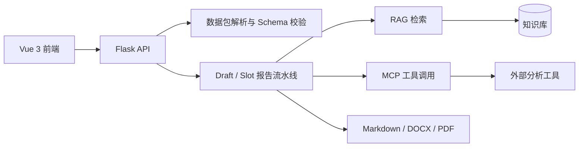

# SimuReport：RAG + MCP 智能可视化报告系统

SimuReport 面向仿真与工程数据分析场景，将数据包解析、知识检索、工具调用、报告编排和多格式导出整合为一套可交互工作流。用户可以上传标准化数据包，通过澄清问答补全生成条件，调用 RAG 与 MCP 工具生成带图表的结构化报告。

## 核心能力

- **多源数据接入**：支持本地目录、ZIP 数据包和标准 Schema JSON，并提供结构校验与元数据提取。
- **可控报告工作流**：使用 Draft/Slot 模型拆分章节，支持逐槽生成、人工编辑、确认和重新生成。
- **RAG 知识增强**：组合向量检索与 BM25，为报告生成和智能问答提供可追溯的领域上下文。
- **MCP 工具编排**：统一暴露工具发现、参数调用、执行日志与统计接口，便于接入外部分析能力。
- **数据可视化**：通过 ECharts 呈现数据概览、分析结果和报告图表。
- **权限与组织隔离**：提供用户、管理员和开发者角色，以及组织级知识与报告协作空间。
- **多格式导出**：支持 Markdown、DOCX 和 PDF 报告导出。

## 系统架构



## 技术栈

- 前端：Vue 3、Vue Router、Vite、Element Plus、ECharts
- 后端：Python、Flask、SQLite、PyJWT
- 智能能力：OpenAI 兼容接口、ChromaDB、BM25、MCP
- 文档处理：python-docx、ReportLab 及相关解析组件
- 性能测试：Apache JMeter

## 项目结构

```text
.
├─ frontend/          # Vue 3 Web 应用
├─ server/            # Flask API、认证、任务与数据管理
├─ reportgen/         # 报告生成、检索与导出核心逻辑
├─ integration_demo/  # 第三方软件接入示例
├─ tests/jmeter/      # 性能测试计划与运行脚本
├─ 知识库/             # 可公开的示例知识卡片
├─ 数据包/             # 可公开的示例数据包
├─ docs/              # API、MCP 与部署文档
└─ requirements.txt
```

## 快速开始

### 1. 安装后端依赖

```bash
python -m venv .venv

# Windows
.venv\Scripts\activate

# macOS / Linux
source .venv/bin/activate

pip install -r requirements.txt
```

### 2. 配置环境变量

PowerShell：

```powershell
$env:DEEPSEEK_API_KEY = "your_deepseek_key"
$env:TAVILY_API_KEY = "your_tavily_key"   # 可选
$env:JWT_SECRET = "replace_with_a_random_secret"
```

Bash：

```bash
export DEEPSEEK_API_KEY="your_deepseek_key"
export TAVILY_API_KEY="your_tavily_key"   # 可选
export JWT_SECRET="replace_with_a_random_secret"
```

### 3. 启动后端

```bash
python server/app_v2.py
```

后端默认运行在 `http://localhost:5000`。

### 4. 启动前端

```bash
cd frontend
npm install
npm run dev
```

前端默认运行在 `http://localhost:3001`。

## 典型流程

1. 上传或选择符合规范的数据包。
2. 系统解析变量、层级与可视化资源，并校验 Schema。
3. 用户通过澄清问答确定领域、用途和报告模板。
4. 报告引擎创建 Draft 与 Slot，结合知识库和 MCP 工具逐步生成内容。
5. 用户审核、编辑并确认各个章节。
6. 系统导出 Markdown、DOCX 或 PDF 报告。

## API 入口

- 健康检查：`GET /api/health`
- 数据接入：`POST /api/upload-folder`、`POST /api/upload`、`POST /api/ingest`
- 一键报告：`POST /api/v1/report/generate`
- 草稿流程：`/api/draft`、`/api/slots/*`、`/api/export/report`
- 知识库：`/api/kb/*`
- MCP：`/mcp/tools/list`、`/mcp/tools/call`、`/api/mcp-chat-stream`

详细请求示例参见 [`docs/API使用文档.md`](docs/API使用文档.md)，MCP 接入方式参见 [`docs/MCP工具文档.md`](docs/MCP工具文档.md)。

## 测试

仓库保留了可复现的 JMeter 测试计划。请单独安装 Apache JMeter 后运行：

```bash
jmeter -n -t tests/jmeter/SimuReport_TestPlan.jmx -l tests/jmeter/results/result.csv
```

测试计划覆盖健康检查、认证、数据校验、知识库、组织、MCP、异步任务和管理员接口。

## 配置与安全

- 示例账号和默认密钥仅用于本地开发，部署前应通过环境变量覆盖。
- `.env`、SQLite 数据库、上传文件、生成结果和本地知识库内容不会提交到仓库。
- SQLite 适合单机部署；多实例部署建议迁移到独立数据库服务。
- PDF 导出依赖本地渲染环境，部署前应单独验证字体与文档转换组件。
