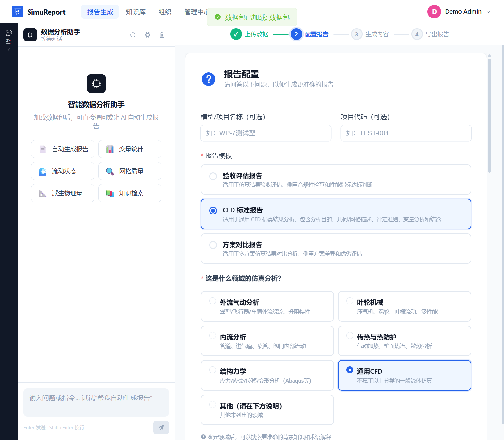
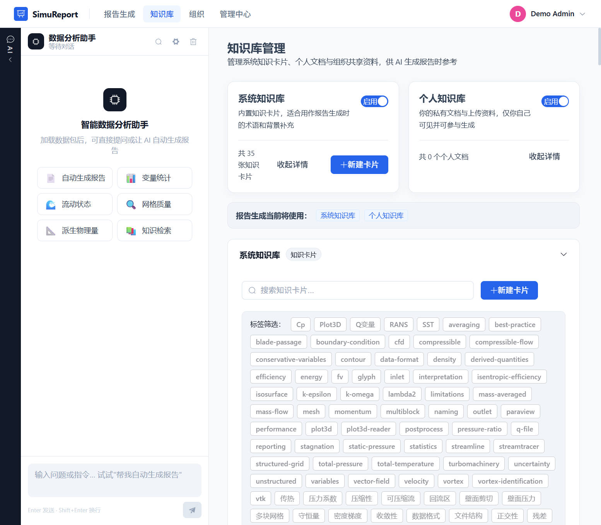
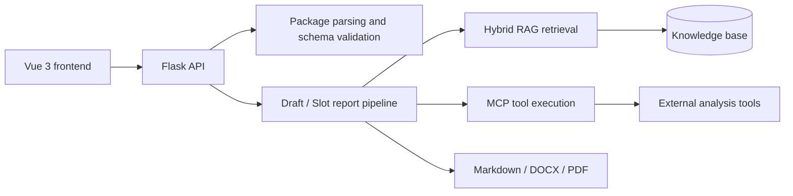

# SimuReport: RAG + MCP Intelligent Report Generation System

[中文说明](README_CN.md)

SimuReport is a full-stack AI application for engineering and simulation data analysis. It combines structured data ingestion, hybrid RAG retrieval, MCP tool orchestration, a human-in-the-loop report workflow, interactive visualization, and Markdown/DOCX/PDF export.

## Interface preview

### Guided report configuration



### Layered knowledge-base management



## Engineering highlights

- **End-to-end AI workflow:** covers data ingestion, requirement clarification, retrieval, section-level review, and final report export.
- **Controllable generation:** uses a Draft/Slot state model so users can edit, approve, or regenerate individual report sections.
- **Hybrid retrieval:** combines ChromaDB vector search with BM25 keyword search to balance semantic relevance and domain terminology.
- **Observable MCP execution:** centralizes tool discovery, parameterized calls, execution logs, and usage statistics.
- **Application boundaries:** includes authentication, role-based access, organization isolation, asynchronous tasks, input validation, and secret masking.

## Core capabilities

- **Multi-source ingestion:** accepts local directories, ZIP packages, and standardized Schema JSON with metadata extraction and validation.
- **RAG-assisted analysis:** supplies traceable domain context for report generation and conversational analysis.
- **MCP tool orchestration:** exposes tool discovery and execution interfaces for external analytical capabilities.
- **Interactive visualization:** uses ECharts for dataset summaries, analytical results, and report figures.
- **Collaborative knowledge:** supports system, personal, and organization-scoped knowledge sources.
- **Multi-format delivery:** exports reports as Markdown, DOCX, and PDF.

## Architecture



## Technology stack

- **Frontend:** Vue 3, Vue Router, Vite, Element Plus, ECharts
- **Backend:** Python, Flask, SQLite, PyJWT
- **AI and retrieval:** OpenAI-compatible APIs, ChromaDB, BM25, MCP
- **Document processing:** python-docx, ReportLab, and related parsers
- **Performance testing:** Apache JMeter

## Repository structure

```text
.
├─ frontend/          # Vue 3 web application
├─ server/            # Flask API, authentication, tasks, and data management
├─ reportgen/         # Report generation, retrieval, and export logic
├─ integration_demo/  # External application integration example
├─ tests/jmeter/      # API performance test plan and runner
├─ 知识库/             # Public sample knowledge cards
├─ 数据包/             # Public sample engineering dataset
├─ docs/              # API, MCP, package, and deployment documentation
└─ requirements.txt
```

## Quick start

### 1. Install backend dependencies

```bash
python -m venv .venv

# Windows
.venv\Scripts\activate

# macOS / Linux
source .venv/bin/activate

pip install -r requirements.txt
```

### 2. Configure environment variables

PowerShell:

```powershell
$env:SIMUREPORT_DEMO_ADMIN_PASSWORD = "choose-a-local-password"
$env:DEEPSEEK_API_KEY = "your_deepseek_key"
$env:TAVILY_API_KEY = "your_tavily_key"   # optional
$env:JWT_SECRET = "replace_with_a-random-secret"
```

Bash:

```bash
export SIMUREPORT_DEMO_ADMIN_PASSWORD="choose-a-local-password"
export DEEPSEEK_API_KEY="your_deepseek_key"
export TAVILY_API_KEY="your_tavily_key"   # optional
export JWT_SECRET="replace-with-a-random-secret"
```

`SIMUREPORT_DEMO_ADMIN_PASSWORD` is intended for local demonstrations only. When set, the application creates a `demo_admin` account; when omitted, no default account is created.

### 3. Start the backend

```bash
python server/app_v2.py
```

The API runs at `http://localhost:5000` by default.

### 4. Start the frontend

```bash
cd frontend
npm install
npm run dev
```

The web application runs at `http://localhost:3001` by default.

## Typical workflow

1. Upload or select a package that follows the project schema.
2. Parse variables, hierarchy, and visualization assets, then validate the package.
3. Clarify the analysis domain, report purpose, and template.
4. Create a report Draft and fill its Slots using retrieved knowledge and MCP tools.
5. Review, edit, and approve individual sections.
6. Export the completed report as Markdown, DOCX, or PDF.

## API entry points

- Health: `GET /api/health`
- Data ingestion: `POST /api/upload-folder`, `POST /api/upload`, `POST /api/ingest`
- One-step report generation: `POST /api/v1/report/generate`
- Draft workflow: `/api/draft`, `/api/slots/*`, `/api/export/report`
- Knowledge base: `/api/kb/*`
- MCP: `/mcp/tools/list`, `/mcp/tools/call`, `/api/mcp-chat-stream`

Detailed examples are available in [API documentation](docs/API使用文档.md), [MCP tool documentation](docs/MCP工具文档.md), and the [integration guide](docs/集成部署指南.md).

## Validation

Run the 10 automated tests for the report-generation core:

```bash
python -m pytest reportgen/tests -q
```

The repository also includes a JMeter plan covering health, authentication, schema validation, knowledge-base, organization, MCP, asynchronous-task, and administration endpoints:

```bash
jmeter -n -t tests/jmeter/SimuReport_TestPlan.jmx \
  -JADMIN_PASSWORD=choose-a-local-password \
  -l tests/jmeter/results/result.csv
```

Build the two frontend applications with:

```bash
cd frontend && npm run build
cd ../integration_demo/frontend && npm run build
```

## Configuration and security

- No API key, database, uploaded document, generated report, or private knowledge-base content is committed.
- A demo administrator is created only when `SIMUREPORT_DEMO_ADMIN_PASSWORD` is explicitly set.
- SQLite is suitable for local and single-instance use; multi-instance deployments should use an external database service.
- LLM-assisted and web-search features require the corresponding provider credentials.
- PDF export depends on the host rendering environment and should be verified with the target fonts and conversion tools.
