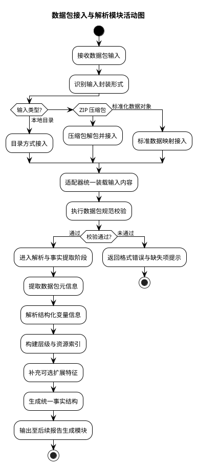

# 输入适配流程图

```plantuml
@startuml
skinparam backgroundColor white
skinparam shadowing false
skinparam defaultFontName Microsoft YaHei
skinparam ArrowColor black
skinparam ArrowThickness 1.1
skinparam activityBorderThickness 1.0
skinparam activityDiamondBorderThickness 1.0
skinparam activity {
  BackgroundColor white
  BorderColor black
  DiamondBackgroundColor white
  DiamondBorderColor black
  BarColor black
  StartColor black
  EndColor black
}

title 数据包接入与解析模块活动图

start
:接收数据包输入;
:识别输入封装形式;

if (输入类型?) then (本地目录)
  :目录方式接入;
elseif (ZIP 压缩包)
  :压缩包解包并接入;
else (标准化数据对象)
  :标准数据映射接入;
endif

:适配器统一装载输入内容;
:执行数据包规范校验;

if (校验通过?) then (通过)
  :进入解析与事实提取阶段;
  :提取数据包元信息;
  :解析结构化变量信息;
  :构建层级与资源索引;
  :补充可选扩展特征;
  :生成统一事实结构;
  :输出至后续报告生成模块;
  stop
else (未通过)
  :返回格式错误与缺失项提示;
  stop
endif

@enduml
```
